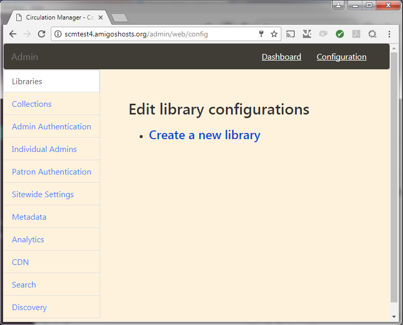

# Configuring a Demo Library #

This document provides the basic instructions necessary to create a "test run" of the Circulation Manager, configuring system settings for a first-time deployment. The instructions do not include settings to activate a DRM-protected library service stream from a commercial service such as Overdrive, Bibliotheca, or Axis 360. Instead, the aim here is to:

1. ensure that the Circulation Manager is deployed successfully,
2. review how the Circulation Manager works,
3. and promote confidence that the organization is ready to deploy a more robust, production Circulation Manager.

(Note: You may see the acronym scm/SCM used in this and other documentation. This is a lazy, informal abbreviation we use for the SimplyE Circulation Manager.)

## Requirements ##
You will need a Chrome or Firefox web browser to access the configuration panel. The admin panel does not display correctly if using *Internet Explorer/Edge*.

You also need the domain name for which you created a DNS entry in the previous document. The administrative panel site will have a URL of the following form:

	http://testscm.example.com/admin

## Perform Web-Based System Configuration ##

1. Log into the new Circulation Manager's administrative configuration panel:
    * Go to the admin panel using your URL
    * Scroll to the bottom of the initial entry screen to the "Create a new individual administrator" form.
    * Enter the email address and password for your first administrative user. You can create additional admin accounts in the configuration utility.
    * Click the submit button to create the first admin account.
    * At the resulting login page, enter the admin credentials you created above and click the *Sign In* button.
    * Click the *Configuration* link in the upper right corner of the admin panel.
    * You should see the main configuration page with eleven configuration sections in a left sidebar, as shown below.
    
2. Verify the initial server settings created automatically for your installation:
    * Click the *Sitewide Settings* item in the left sidebar.
    * Click the *Base url of the application* setting and make sure it is set to the host and domain name you desired (no trailing 'admin' path).
    * For this base testing deployment, no other site settings are necessary.
3. Configure the Elasticsearch service integration for the Circulation Manager:
	* Click the *Search* sidebar item.
	* Click the *Create a new search service* item.
	* Enter a descriptive name for the service, such as "Elasticsearch indexing server"
	* Currently only the Elasticsearch server is supported, so the default *Protocol* item is appropriate.
	* Enter the URL to your Elasticsearch service:
		* for testing Virtualbox and Linode (single-server) implementations, enter the internal container IP-based URL, "http://172.17.0.2:9200".
		* for testing AWS implementations using the AWS ES service, enter the URL to the Elasticsearch server as shown in your ES service console.
    * Unless there is a local reason to change it, leave the default Elasticsearch index name as "works".
    * Click the *Submit* button.
4. Create a Metadata Wrangler integration:
	* Click the *Metadata* sidebar item.
	* Click the *Create a new metadata service* item.
	* Enter a name for the shared Library Simplified Metadata Wrangler service; e.g., "NYPL Metadata Wrangler".
	* In the *Protocol* list, select the "Library Simplified Metadata Wrangler" item.
	* You can accept the supplied URL for the shared wrangler
	* Click the Submit button. *Note: If you happen to receive an error message ("Error: The library could not complete your request because a third-party service has failed"), the Wrangler server may be experiencing high volume or be down for maintenance. Try waiting ten minutes or so and re-submit the form.*
5. Create the first library:
	* Click the *Libraries* sidebar item.
	* Click the *Create a new library* item.
	* Enter a descriptive name that uniquely identifies the library and makes it easy to find in a long list of library names hosted on the Circulation Manager; e.g., "Testing - Demo Library 1".
	* Enter a unique **shortname**, which is used in the OPDS feed path (see the last section of this document) for accessing the library's books from the mobile app; e.g., "test1demo1".
	* Enter a required primary language code for the library's collection(s); e.g., 'eng' for English and/or 'spa' for Spanish. Again, at least one language must be specified.
	* Click the Add button to the right of the primary language field.
	* You can specify other information about the library if desired (help pages, loan periods, etc.), but the above three are required for testing.
	* Click the *Submit* button to create the library.
6. Create a test collection and assign it to the demo library:
	* Click the *Collections* sidebar item.
	* Click the *Create a new collection* item.
	* Enter a descriptive name that uniquely identifies the collection and makes it easy to find in potentially a long list of collections.
	* For a collection available as a simple public OPDS feed, which we'll use here (*note:* composed of 'open-access' or 'borrow' acquisition links; 'buy' links are not supported and such books do not appear in the collection's feed in the SimplyE app), accept the "OPDS Import" protocol.
	* Enter the URL of a publicly accessible feed; for initial testing we will use a small subset of the Library Simplified Open Access collection (a small set of books minimizes import/indexing time and makes the full collection viewable in a short period): http://oacontent.librarysimplified.org/works/sources/Plympton
	* Give the collection a unique data source name; e.g., "oacontent-plympton"
	* Assign the collection to the test library:
		* In the *Add Library* dropdown, select the name of the test library
		* Click the *Add Library* button which appears below the dropdown; this links the collection to the library.
    	* You will see the library in a group list and can delete it if necessary by clicking the 'x' to the right of its name.
    * Click the Submit button to create the collection.
7. Create a test patron authentication configuration
	To run a full test of the Circulation Manager, you will need to be able to authenticate the patron to the library. The web admin utility features a single-user test authentication mechanism. You can use this for testing, but you will need to use connectivity to an authentication resource, typically an ILS, for production systems.
    * Click the *Patron Authentication* sidebar item.
    * Click the *Create a new patron authentication service* item.
    * Again, give the service a descriptive name that is easy to identify in a long list of services.
    * Accept the default "Simple Authentication Provider" in the dropdown list for this test.
    * Enter a test user identifier; for a simulated 14-digit barcode, you might enter the following: 29999087654321.
    * Enter a test password, which in this case should actually be a PIN, something like: 0550.
    * In the Libraries dropdown item, select the test library you created.
    * Click the *Add Library* button at the bottom of the form.
    * Click the *Submit* button.

## Run Commands to Import the Test Collection ##
While the configuration of the collection above creates the database information needed to access the collection, and to contact a metadata wrangler to provide additional/enhanced metadata if available, it does not actually result in books being added to the collection. The OPDS feed import option does not have a corresponding import script that is scheduled to run on the server. You will need to access the Circulation Manager host and execute the script manually.

### Log in to the Circulation Manager ###

When deploying the Circulation Manager host resources locally in VirtualBox or online using Linode.com, the instructions provided allow you to connect remotely to the host with a Vagrant command:
```
vagrant ssh
```

This will be the simplest way to connect. However, it isn't the most secure way to connect. For production servers, you should disable remote access to the host by the root user and enforce private-key-based access (with passphrase) only.

For deployments to Amazon Web Services, since this repository uses Ansible alone for AWS deployments, one should create a standard SSH connection. Future additions to the documentation will include specific instructions as needed.

### Run Scripts to Import the Collection ###

There are two Docker containers that provide Circulation Manager services: circ-scripts and circ-deploy. The circ-deploy container actually hosts the application; the circ-scripts container hosts the management scripts. Management scripts that are required to keep the Circulation Manager operating appropriately are already scheduled to run periodically.

However, the script which controls OPDS feed imports is not run automatically. To access the proper Docker container and execute the script, run the following command on the host:
```
sudo docker exec circ-scripts ../core/run /var/www/circulation/bin/opds_import_monitor >> /var/log/cron.log 2>&1
```

The test collection, at the time of this writing, has about 70+ titles. Give the server fifteen minutes or so to complete importing the works from the feed.

Once the import process is complete, if you wish to review the import logs, execute the following command:
```
sudo docker exec circ-scripts cat /var/log/libsimple/opds_import_monitor.log
```

After the title data is imported from the feed, the views of the collection may need to be "refreshed" before those titles will be available in the OPDS feed to the SimplyE app. However, the script to refresh the views only runs every 6 hours. To run the script manually, execute the following command:
```
sudo docker exec circ-scripts ../core/run /var/www/circulation/bin/refresh_materialized_views >> /var/log/cron.log 2>&1
```

## Logging into the Docker Container Directly ##
Instead of issuing the long commands in the previous section, you may wish to log into a console session inside the container. Issue the command:
```
sudo docker exec -it circ-scripts /bin/bash
```

Once you receive a command prompt in the container, you can then run the above commands directly, without a docker reference. Using the first OPDS import command as an example:
```
../core/run /var/www/circulation/bin/opds_import_monitor >> /var/log/cron.log 2>&1
```

## Configuring Custom Lanes for the SimplyE Mobile App ##
The SimplyE mobile app presents subsets of a library's collection, usually specific genres and/or sub-genres of a collection, as a set of carousels termed *lanes* in its primary interface. Lanes are automatically generated from the metadata included in an ebook data feed. However, the lanes presented can be customized. Lane customization must be specified in a JSON-formatted configuration file (as of v.2.0.7). Specific elements and examples of lanes are documented in the official Simplifed wiki under *[LaneConfiguration](https://github.com/NYPL-Simplified/Simplified/wiki/LaneConfiguration)*.

An example lane configuration file is provided in the files directory of the repository. Instructions to provide a configuration file in your test deployment are provided in the main README file.

## Configuring an Alternate URL in the SimplyE Mobile App ##
Once the system is configured and the test feed is imported, you can set up the generic SimplyE mobile app to point to your test library's collection by using a tap sequence to open up a hidden prompt.

1. Open the SimplyE app on your device.
2. Tap the menu icon.
3. Tap the *Settings* item.
4. In rapid succession, tap the *Version* entry eight times.
5. Tap the *Alternate URIs* entry which appears.
6. In the *Feed URI* field, enter the URL to the test library's OPDS feed; the feed will be of the following form, ending with the shortname mentioned above when creating the library settings:
```
http://hostname.example.com/shortname
```
7. Click the *Set* button at the bottom of the form.
8. Click the back arrow icon to go back to *Settings*.
9. Click the menu icon.
10. Click the *Catalog* item to display books in the test library's collection.

This manual mechanism is available for informally testing library collections. In production scenarios, each library created in the admin panel must be *registered* using the *Discovery* sidebar item and the *Simplified Library Registry*. The process of registering a library's circulation feed will enable the development team to include the library in the selector of available library feeds in the generic SimplyE mobile app. Do not register test libraries.
